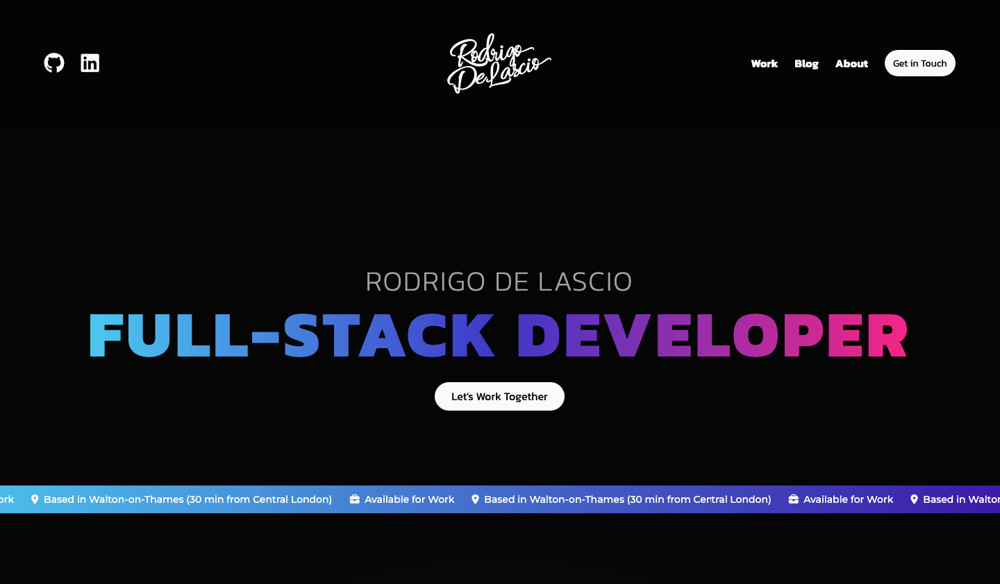
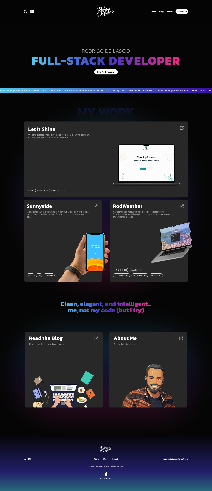
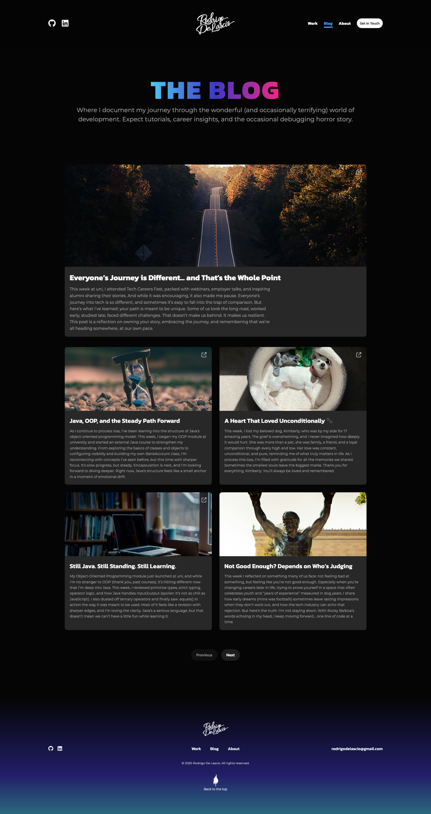

# Personal Portfolio Website

A handcrafted personal portfolio built with HTML, CSS and Vanilla JavaScript, designed to showcase my work, writing, and development approach as a career-changing computing student and junior developer.

This project intentionally avoids frameworks to demonstrate a solid understanding of core web technologies, layout systems, performance considerations, and browser APIs.

---

## Overview

This portfolio acts as both a professional showcase and a learning artefact.

It includes:

- A landing page introducing who I am and how I work
- Individual project pages explaining real design and development decisions
- A blog powered by a headless CMS, where I document my learning journey
- A clean, responsive UI focused on readability, accessibility, and performance

Rather than optimising for speed of development, this project prioritises clarity, maintainability, and understanding of fundamentals.

---

## Why Vanilla JavaScript?

This portfolio was deliberately built without frameworks such as React or Next.js.

As a career changer entering the industry, I wanted to demonstrate that I can:

- Build complete interfaces from first principles
- Work confidently with the DOM, events, and browser APIs
- Structure CSS without relying on component libraries
- Make intentional architectural decisions rather than defaulting to abstractions

Frameworks are tools, not crutches. This project shows what I can do without them.

---

## Features

- Fully responsive layout using Flexbox and modern CSS
- Semantic HTML structure for accessibility and SEO
- Individual project pages with detailed explanations
- Blog powered by Hygraph (headless CMS)
- Optimised images and lazy loading where appropriate
- Custom UI components and hover interactions
- Framework-free, dependency-light setup

---

## Screenshots

### Landing Page

### Blog

---

## Built With

- HTML5
- CSS3 (Flexbox, custom properties, responsive design)
- Vanilla JavaScript (ES6+)
- Hygraph Headless CMS (for blog content)

No frameworks. No UI libraries. No build tools.

---

## Project Structure

The site is organised with clarity and separation of concerns in mind:

- Page-specific stylesheets rather than a single monolithic CSS file
- Small, focused JavaScript files per page where behaviour is needed
- Static HTML pages for predictability and performance
- Content managed externally where it makes sense (blog)

---

## What I Would Do Differently

This project intentionally prioritised fundamentals over abstraction. That said, revisiting it with fresh eyes highlights several areas I would approach differently in a future iteration:

- **Introduce a lightweight build step**  
  While working without a build tool helped reinforce core concepts, a minimal setup using Vite or similar would improve asset optimisation, bundling, and development ergonomics without obscuring fundamentals.

- **Stronger CSS architecture**  
  Page-specific stylesheets worked well at this scale, but for a larger project I would introduce a more formal CSS architecture, such as utility layers or a stricter naming convention, to improve long-term scalability.

- **Progressive enhancement for animations**  
  Interactive elements are currently designed to degrade gracefully, but future enhancements could make better use of progressive enhancement patterns to ensure animations never impact performance or accessibility.

- **Deeper accessibility auditing**  
  Semantic HTML was a priority from the start, however I would like to add more explicit testing using screen readers and automated accessibility tools to validate real-world usage.

- **Component abstraction where it adds value**  
  Certain UI patterns could be abstracted more cleanly once their behaviour and usage are fully understood, rather than abstracting prematurely.

Overall, this project reflects a deliberate learning-first approach. The decisions made here were intentional, and the lessons learned directly inform how I approach newer, more complex applications.

---

## Live Site

🔗 **Live URL:**  
https://rodrigodelascio.co.uk/

---

## About Me

I am a UK-based BSc Computing student and career changer, transitioning from a long background in content, localisation, and digital marketing into software development.

This portfolio reflects how I think, learn, and build, not just what I know.

---

## Author

- Website: https://rodrigodelascio.co.uk/
- GitHub: https://github.com/rodrigodelascio
- LinkedIn: https://www.linkedin.com/in/rodrigo-de-lascio/

---

## Notes

This project is actively evolving.  
Future enhancements may include scroll-based animations, performance refinements, and additional case-study depth as the portfolio grows.
